# Active Directory Home Lab Documentation

## Overview: What This Entire Lab Is

This project documents the setup of a **mini Active Directory (AD) home lab** using virtualization. The goal is to simulate a real-world corporate IT environment on a single computer for **learning, practice, and skill retention**.

In this lab, I built:

* A **Domain Controller (DC)** that manages users, computers, authentication, DNS, and DHCP.
* A **Client computer** that joins the domain and authenticates using domain credentials.
* A **virtual network** that mimics how real enterprise networks operate.

This lab allows hands-on practice with **real IT administration tasks** without needing physical servers.

---

## Technologies Used

* Oracle VirtualBox
* Windows Server (2019 / 2022)
* Windows 10
* Active Directory Domain Services (AD DS)
* DNS
* DHCP
* PowerShell

---

## Lab Architecture (High Level)

* **Domain Controller**

  * Two network adapters (NAT + Internal Network)
  * Runs AD DS, DNS, DHCP

* **Client Machine**

  * One network adapter (Internal Network only)
  * Joins the domain

---

## Step-by-Step Lab Walkthrough (With Reasons)

### 1. Download Software and OS Files

**What was done:**

* Downloaded Oracle VirtualBox
* Downloaded Windows Server ISO
* Downloaded Windows 10 ISO

**Why this was done:**
VirtualBox allows multiple operating systems to run on one physical machine. The ISOs are installation media for the server and client operating systems used in the lab.

---

### 2. Create the Server Virtual Machine (Domain Controller)

**What was done:**

* Created a new VM named `DC`
* Selected Microsoft Windows as the OS
* Assigned memory (around 2 GB) and storage

**Why this was done:**
This VM represents a physical server in a real environment. It will later be promoted to a Domain Controller, acting as the central authority for the domain.

---

### 3. Configure Two Network Adapters on the Server

**What was done:**

* Adapter 1 set to **NAT**
* Adapter 2 set to **Internal Network**

**Why this was done:**

* NAT provides internet access for updates and tools
* Internal Network creates a private LAN for domain communication

This mirrors real servers that have both external and internal network access.

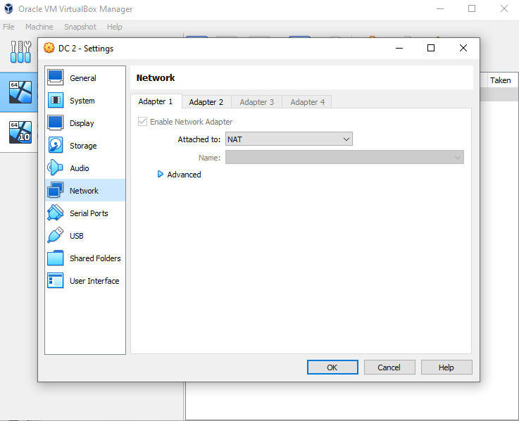

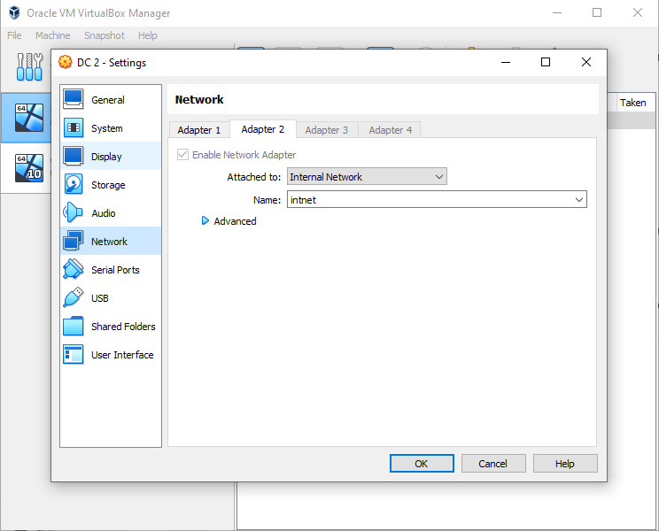

---

### 4. Install Windows Server on the Server VM

**What was done:**

* Mounted the Windows Server ISO
* Completed installation
* Selected **Desktop Experience**

**Why this was done:**
Active Directory requires Windows Server. Desktop Experience provides a GUI, making management easier for learning purposes.

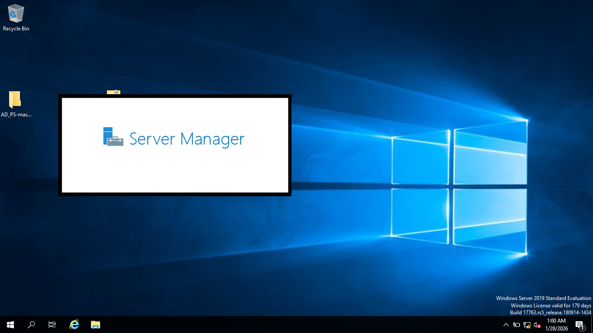

---

### 5. Rename the Server and Configure Static IP

**What was done:**

* Renamed the computer to `DC`
* Assigned a static IP to the internal adapter
* Set DNS to the server itself

**Why this was done:**
Domain Controllers must have static IP addresses to remain reachable. DNS pointing to itself allows the server to resolve domain-related records.

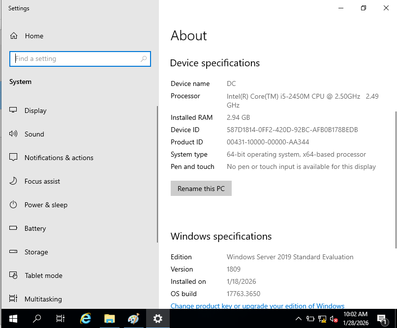

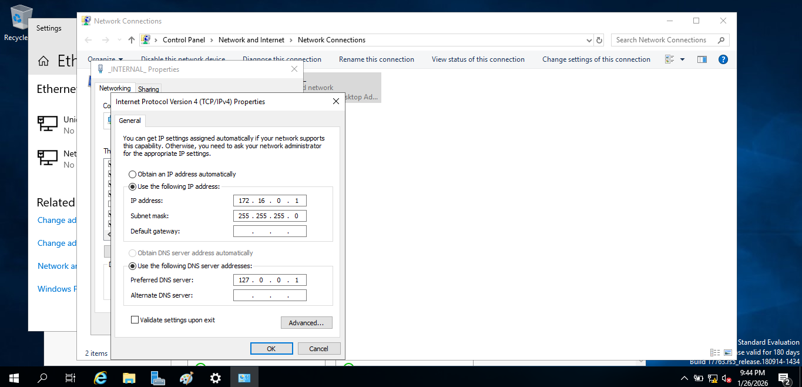

---

### 6. Install Active Directory Domain Services (AD DS)

**What was done:**

* Installed the AD DS role via Server Manager

**Why this was done:**
This role enables the server to manage users, computers, authentication, and policies. Without AD DS, the server cannot act as a Domain Controller.

---

### 7. Promote the Server to a Domain Controller

**What was done:**

* Created a new forest
* Defined a domain name
* Set a DSRM password
* Restarted the server

**Why this was done:**
Promotion officially makes the server the Domain Controller. The forest is the top-level AD structure, and the domain becomes the identity boundary for authentication.

---

### 8. Create Organizational Units and a Domain Admin User

**What was done:**

* Opened Active Directory Users and Computers
* Created an OU for administrators
* Created a new domain admin user

**Why this was done:**
Using separate admin accounts is a security best practice. OUs help logically organize objects and apply policies efficiently.

---

### 9. Install and Configure NAT / Routing (Optional)

**What was done:**

* Installed Remote Access role
* Configured NAT

**Why this was done:**
This allows internal domain machines to access the internet through the Domain Controller, simulating real enterprise routing behavior.

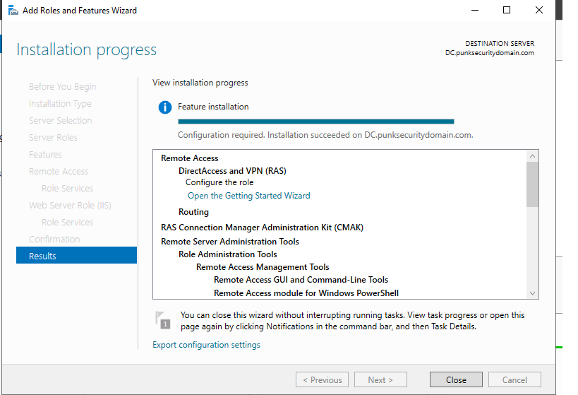

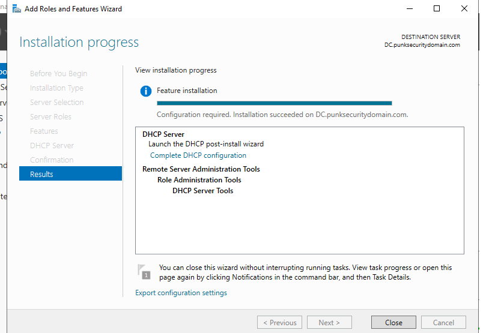

---

### 10. Install and Configure DHCP

**What was done:**

* Installed DHCP role
* Created a scope with IP range
* Configured DNS and gateway options

**Why this was done:**
DHCP automates IP assignment for clients, reducing manual configuration and preventing IP conflicts.

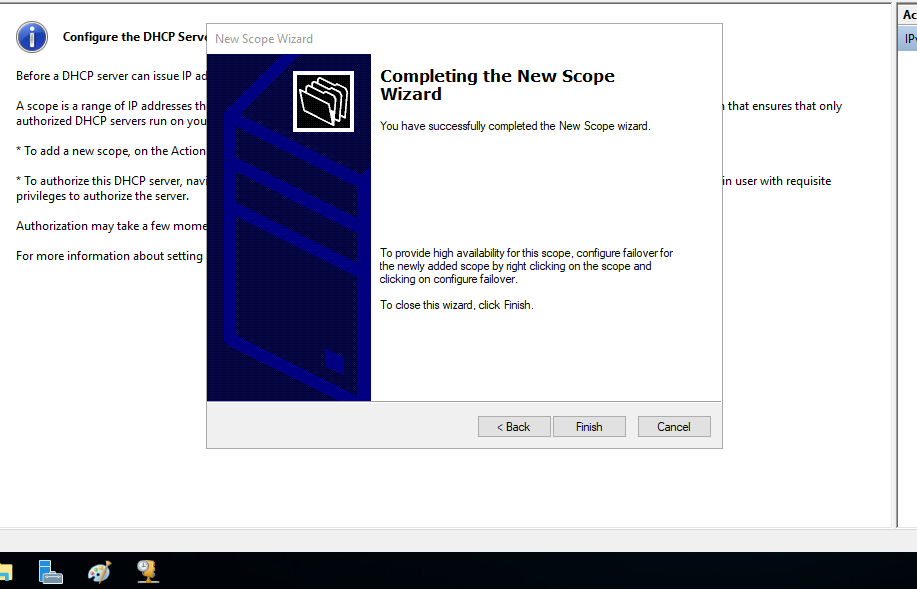

---

### 11. Create Users (Manual and Automated)

**What was done:**

* Used PowerShell scripts to bulk-create users

**Why this was done:**
This demonstrates both basic user management and automation, which is essential in real IT environments with many users.

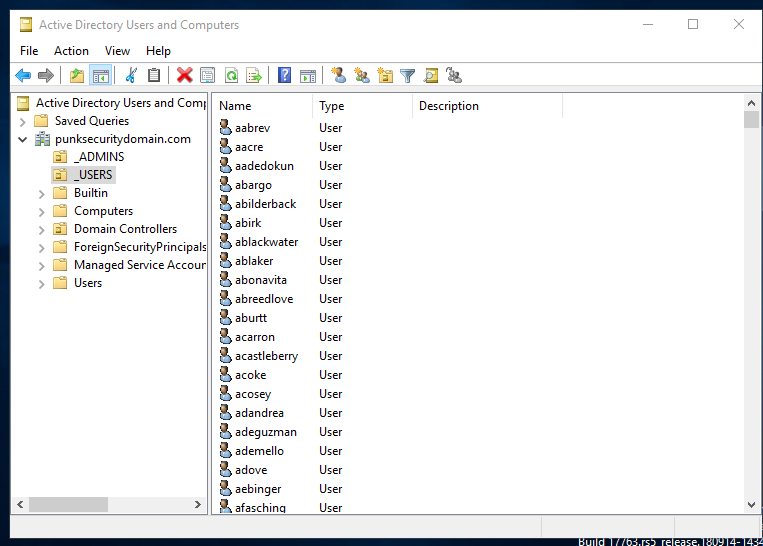

---

### 12. Create the Client Virtual Machine

**What was done:**

* Created a Windows 10 VM
* Assigned Internal Network adapter
* Installed Windows 10

**Why this was done:**
The client simulates an employee workstation that will join the domain and authenticate using centralized credentials.

---

### 13. Join the Client to the Domain

**What was done:**

* Changed system membership from Workgroup to Domain
* Joined using domain admin credentials

**Why this was done:**
This step establishes trust between the client and Domain Controller, enabling centralized login, policy enforcement, and user management.

---

## Key Concepts Learned

* Difference between network connectivity and domain membership
* Role of DNS in Active Directory
* Importance of static IPs for servers
* How DHCP automates networking
* How domain authentication works

---

## Problems faced and the solution

**Issue**:
The virtual machine failed to start when attempting to power it on in VirtualBox.

**Observation**:
Upon checking Task Manager → Performance → CPU, virtualization was shown as Disabled.

**Cause**:
Hardware virtualization was disabled in the system BIOS. VirtualBox requires CPU virtualization features (Intel VT-x or AMD-V) to run virtual machines.

**Solution**:

Restarted the PC and entered the BIOS/UEFI settings on the HP computer

Located the Virtualization Technology option

Enabled virtualization

Saved changes and rebooted into Windows

Verified virtualization was enabled in Task Manager

Restarted VirtualBox and successfully powered on the virtual machine

Result:
The virtual machine started normally, and the Active Directory lab setup was able to continue.

Virtualization in task manager before and after resolution

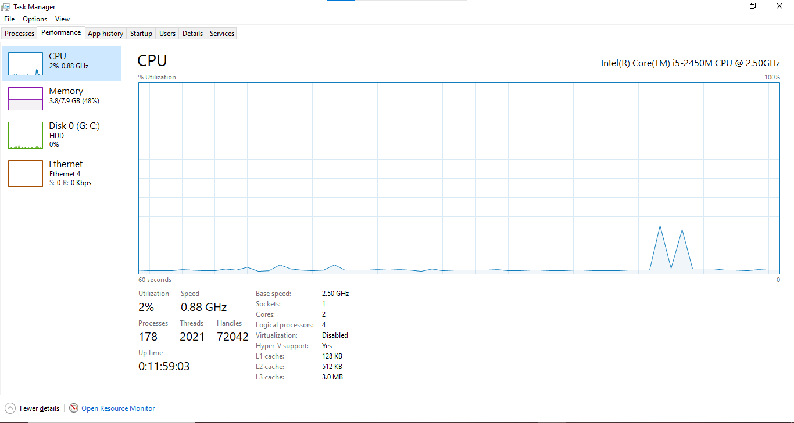

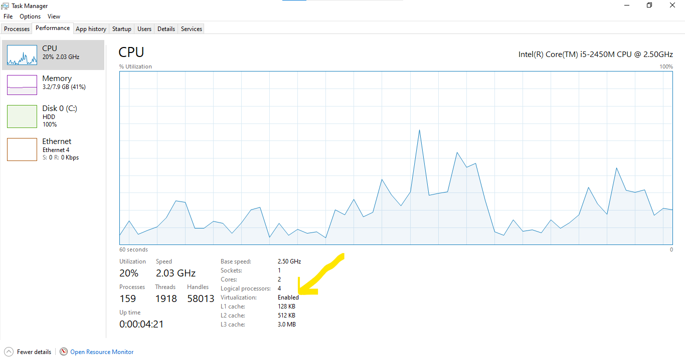

---

## Outcome

By completing this lab, I gained practical experience with enterprise-level Windows networking concepts and Active Directory administration in a controlled environment.

